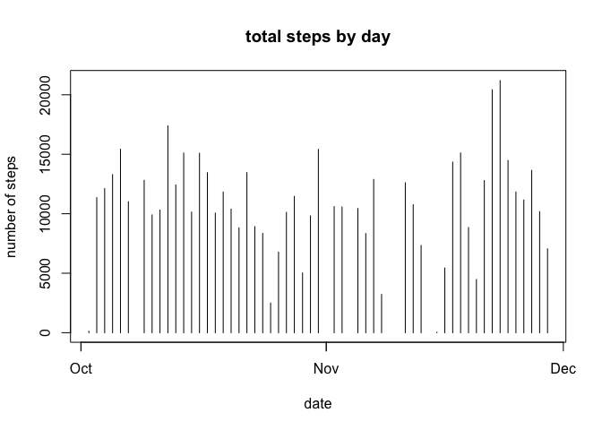
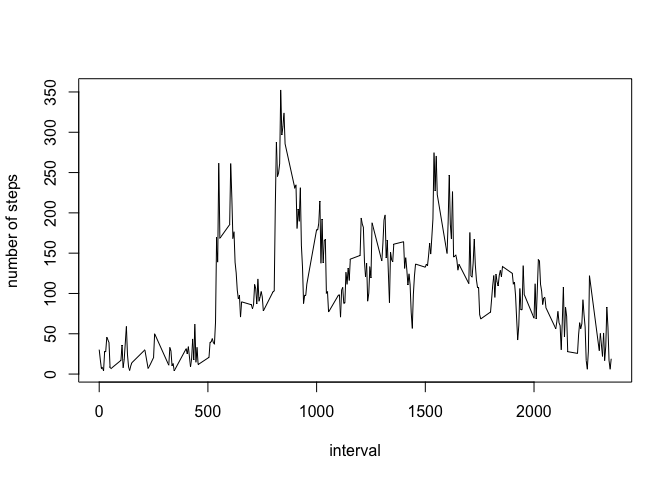
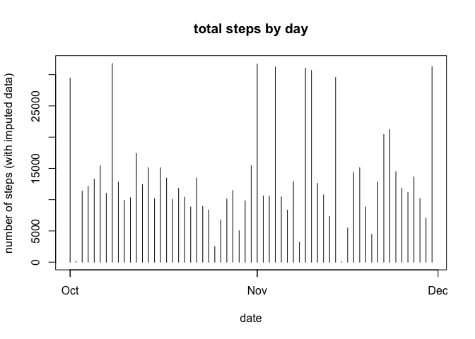
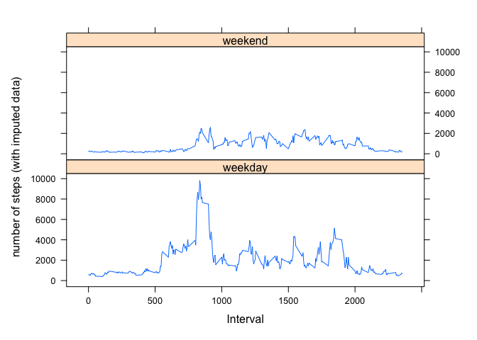

## Introduction

Assignment for module 2 of reproducible research course

Date: 2023-03-15
By: Christof

## Loading and preprocessing the data

### retrieve file


```r
file_url <- "https://d396qusza40orc.cloudfront.net/repdata%2Fdata%2Factivity.zip"
temp <- tempfile()
download.file(file_url, temp)
unzip(temp, "activity.csv")
unlink(temp)
```

### read the data

```r
act_data <- read.csv("activity.csv", header = TRUE, sep = ",")
act_data$date <- strptime(act_data$date, "%Y-%m-%d") # transform to a date
```

### for checking the data


```r
str(act_data)
```

```
## 'data.frame':	17568 obs. of  3 variables:
##  $ steps   : int  NA NA NA NA NA NA NA NA NA NA ...
##  $ date    : POSIXlt, format: "2012-10-01" "2012-10-01" ...
##  $ interval: int  0 5 10 15 20 25 30 35 40 45 ...
```

```r
summary(act_data)
```

```
##      steps             date                           interval     
##  Min.   :  0.00   Min.   :2012-10-01 00:00:00.00   Min.   :   0.0  
##  1st Qu.:  0.00   1st Qu.:2012-10-16 00:00:00.00   1st Qu.: 588.8  
##  Median :  0.00   Median :2012-10-31 00:00:00.00   Median :1177.5  
##  Mean   : 37.38   Mean   :2012-10-30 23:32:27.53   Mean   :1177.5  
##  3rd Qu.: 12.00   3rd Qu.:2012-11-15 00:00:00.00   3rd Qu.:1766.2  
##  Max.   :806.00   Max.   :2012-11-30 00:00:00.00   Max.   :2355.0  
##  NA's   :2304
```

```r
head(act_data)
```

```
##   steps       date interval
## 1    NA 2012-10-01        0
## 2    NA 2012-10-01        5
## 3    NA 2012-10-01       10
## 4    NA 2012-10-01       15
## 5    NA 2012-10-01       20
## 6    NA 2012-10-01       25
```

## What is the mean total number of steps taken per day?

### Remove the NAs from the data set and aggregate steps per day


```r
## load package
library(dplyr)
```

```
## 
## Attaching package: 'dplyr'
```

```
## The following objects are masked from 'package:stats':
## 
##     filter, lag
```

```
## The following objects are masked from 'package:base':
## 
##     intersect, setdiff, setequal, union
```

```r
## remove NAs from data set & aggregate steps per day
num_day_data <- act_data %>%
      group_by(date) %>%
      filter(steps != is.na(steps)) %>%
      summarise(daily_steps = sum(steps))
```

### Histogram of total of steps per day without NAs


```r
plot(num_day_data, type = "h", ylab = "number of steps", xlab = "date", main = "total steps by day")
```

<!-- -->

### Calcuting the mean and median


```r
mean_daily <- as.integer(mean(num_day_data$daily_steps))
median_daily <- as.integer(median(num_day_data$daily_steps))
```

Mean = 10766

Median = 10765

## What is the average daily activity pattern?

### Create a time series line plot with x-axis 5 minute interval and y-axis


```r
## remove NAs from data set & averge steps per interval
num_interval_data <- act_data %>%
      group_by(interval) %>%
      filter(steps != is.na(steps)) %>%
      summarise(interval_steps = mean(steps))
## create the plot
plot(num_interval_data$interval, num_interval_data$interval_steps, type = "l", xlab = "interval", ylab = "number of steps")
```

<!-- -->

### Determine the 5 minute interval with the highest average steps


```r
max_value <- max(num_interval_data$interval_steps)
max_interval <- num_interval_data$interval[num_interval_data$interval_steps == max_value]
```

Highest average steps in any interval = 352.483871

The interval with the highest average steps = 835

## Imputing missing values

### Calculate and report the total number of missing values in the dataset (i.e. the total number of rows with NAs)


```r
sum_missing_values <- sum(is.na(act_data$steps))  # for the steps data
```

Number of rows that have missing values for steps: 2304 (can be verified with the summary of act_data)

### Create a new dataset that is equal to the original dataset but with the missing data filled in.

Strategy: Filling in the missing values with mean of that interval across the period


```r
## remove NAs from data set by replacing the NA's
imputed_data <- act_data %>%
      mutate(new_steps = ifelse(is.na(steps), num_interval_data$interval_steps[num_interval_data$interval %in% interval], steps))
```

### Histogram

Make a histogram of the total number of steps taken each day and Calculate and report the mean and median total number of steps taken per day.


```r
## gather the data for the plot
num_day_imputed_data <- imputed_data %>%
      group_by(date) %>%
      summarise(daily_steps = sum(new_steps))

#create the plot
plot(num_day_imputed_data, type = "h", ylab = "number of steps (with imputed data)", xlab = "date", main = "total steps by day")
```

<!-- -->

Calcuting the mean and median


```r
# mean and median calculated with imputed data
mean_imputed_daily <- as.integer(mean(num_day_imputed_data$daily_steps)) 
median_imputed_daily <- as.integer(median(num_day_imputed_data$daily_steps))

# difference with original data
div_mean <- (1 - mean_imputed_daily / mean_daily)
div_median <- (1 - median_imputed_daily / median_daily)
```

Do these values differ from the estimates from the first part of the assignment? What is the impact of imputing missing data on the estimates of the total daily number of steps?

| Data set | With NA's removed |         Imputed          |     Change     |
|:--------:|:-----------------:|:------------------------:|:--------------:|
|   Mean   |  10766   |  13397  |  -0.2443805  |
|  Median  | 10765  | 11458 | -0.0643753 |
|          |                   |                          |                |

The impact on the mean - for me - is significant. After a quick look the cause is likely that there are days for which many intervals have NA values. As a result these dates get a significant increased number of steps as result of the imputation. For example 1st of Oct 2012 only has NAs.

## Are there differences in activity patterns between weekdays and weekends?

### categorising the data using the imputed data set


```r
# using data set "imputed_data" as source
weekenddays <-c("Sunday", "Saturday")
imputed_data_categorised <- imputed_data %>%
      mutate(day_of_week = weekdays(date)) %>%
      mutate(category = factor(ifelse((day_of_week %in% weekenddays), "weekend", "weekday"))) %>%
      group_by(category, interval)  %>%
      summarise(daily_steps = sum(new_steps), .groups = 'keep')
```

### creating a panel plot using weekend and weekdays based on factor variable "category"


```r
library(lattice)
xyplot(daily_steps ~ interval | category, data = imputed_data_categorised, layout = c(1, 2), type = "l", xlab = "Interval", ylab = "number of steps (with imputed data)")
```

<!-- -->
